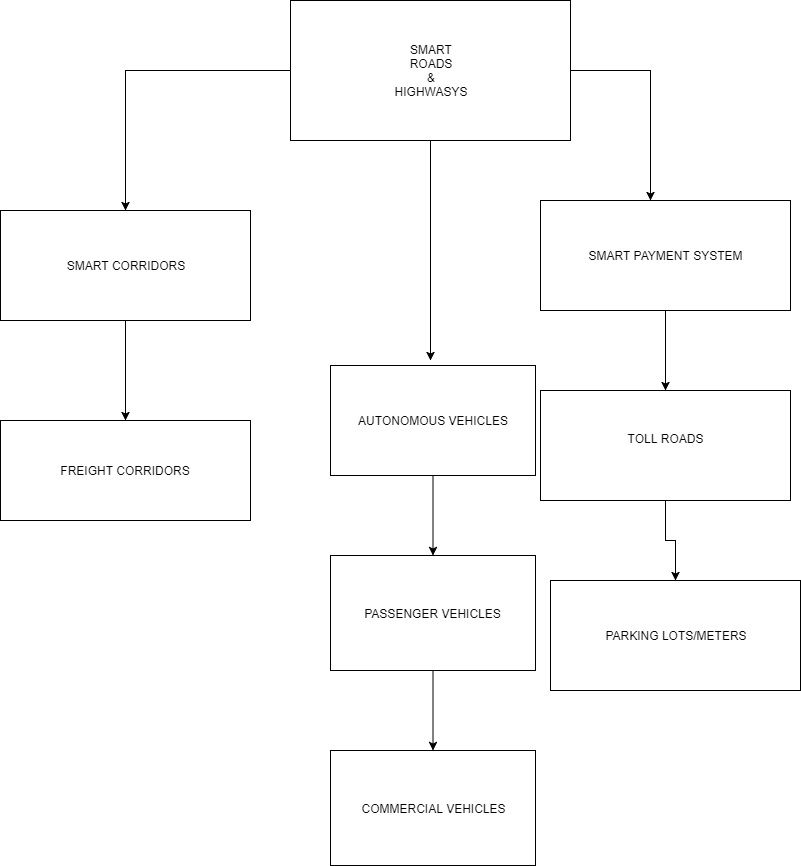
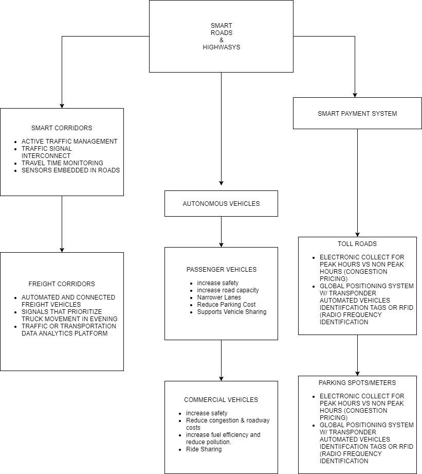
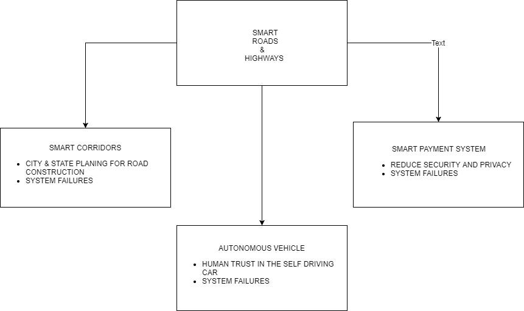

# Assignment1 - Practice Designing Models (Template)
(remove: **text between brackets to be removed**)

> * Participant name: Adam Hardney
> * Project Title: Smart Roads & Highways 

## General Introduction
As the search for affordable housing continues to push people further away from the city and have people commuting further then ever. Roads into and from downtown experience ever growing congestion. Smart roads and highways of the future should increase mobility and relieve congestion on roads and highways. 
Freight and Passenger volumes are projected to increase by more than 60 percent over the next 30 years, straining our roads and highways. As the demand for  transportation increase transporation network needs a upgrade.

## Requirements (Experimental Design)

Large cities such as Orlando experience congestion thoughout the day. New technologies, like automated and connected vehicles, will soon make travel significantly safer and more convenient. Advance in technologies will enable governments and private commpanies alike to improve the transportation grid. Cities should be able to determine there particular needs. The requirments that would makes the roads and highways more efficiency are listed below.
1. Smart Corridors
2. Autonomous Vehicles 
3. Smart Payment Systems

## Smart City (My Problem) Model 

## Smart City (My Problem) Simulation

The simulation aspect of the design of the systems I purpose will have be conducted on connected infrastructure to data analytics. The simulation has been going on for the autonomous vehicle for years. They have almost done million of miles with passenger and commerical vehicles without any serious or fatal crashes. (model/README.md)

## Smart City (My Problem) Model
[**Code template**](code/README.md) - Starting coding framework for the (insert your exact problem here.)

## **P**ortable **O**rganic **T**rouble-free **S**elf-watering System (**POTS**) Model
Here [**we provide an overview**](code/POTS_system/README.md) of the **P**ortable **O**rganic **T**rouble-free **S**elf-watering System (**POTS**) Model and provide a source code template.
