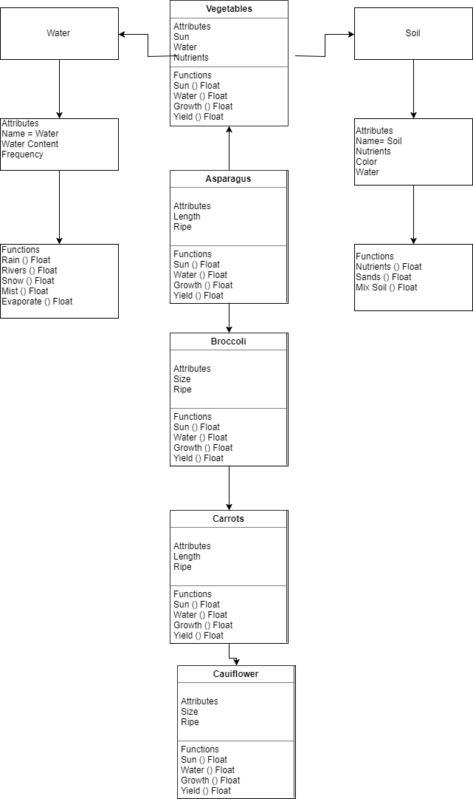

## **P**ortable **O**rganic **T**rouble-free **S**elf-watering System (**POTS**) Model

This model is very simple. It all start with planting vegetables, but it start with putting the vegatable in a pot instead of the ground. Then you have your soil and water. Then you will let nature take it course.

The code does run, try it if you want. It does not do much at all as I'm a novice. It is very, very, very basic code

Example linked diagram to help you.

More Description

